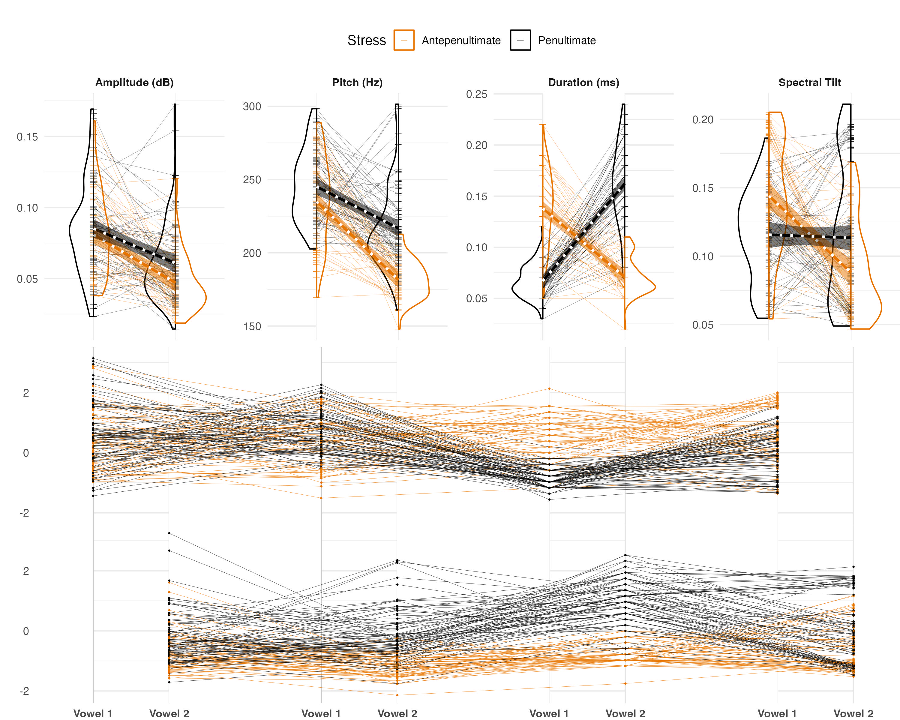
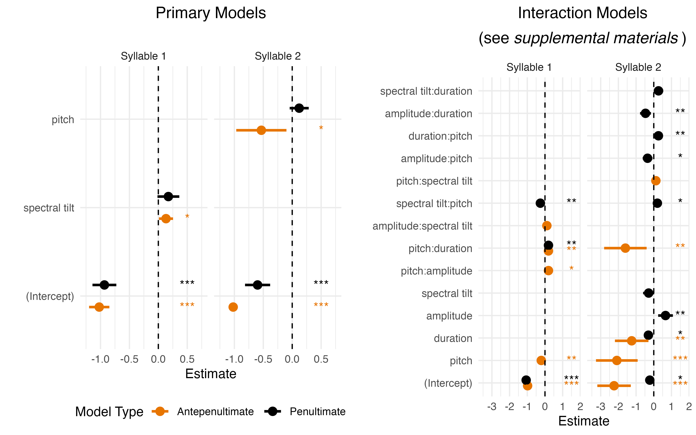
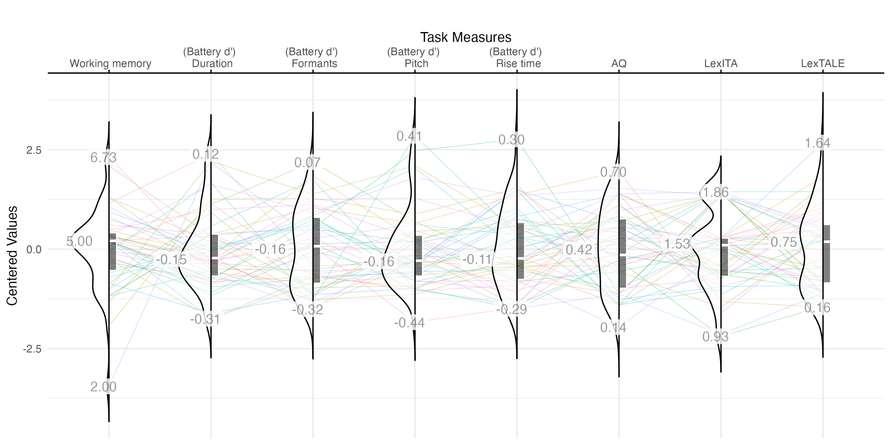
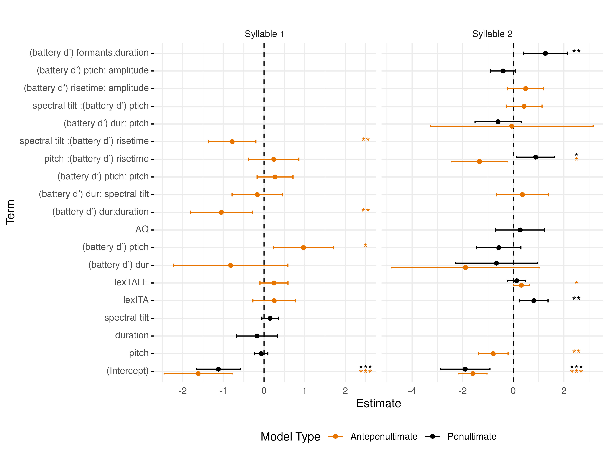

# ppcc_Iflu

# Italian Word Stress: Replication & Extension

## *Reference:*

Bramlett, A. A. & Wiener, S. (2024). Italian Word Stress: A Replication & LASSO Extension of Sulpizio & McQueen (2012). *Journal of Cultural Cognitive Science.*

## Resources

For details and resources, visit: [Open Science Framework - Project Repository]([https://osf.io/xyz123/?view_only=examplelink](https://osf.io/tfc8r/?view_only=085713b90a994403b25c31883f6cdccd)).

## Overview

Replicates and extends Sulpizio & McQueen (2012) by exploring stress cues in Italian word recognition using a visual world paradigm. 
Tested 47 participants. Results show early use of stress information, spectral tilt, and F0 predicted recognition of antepenultimate stress. 
Exploratory analyses examined individual differences in cue use, timing, and linguistic knowledge.

## Analyses

### Acoustic Analysis
- **What it is:** Examined acoustic features: pitch, duration, amplitude, and spectral tilt.
- **Findings:** Antepenultimate stressed words showed higher spectral tilt and duration (syllable 1) compared to penultimate. Matches the original study.

- **Figure 1:** Acoustic Features by Stress Types.

  

### Target & Competitor Analysis
- **What it is:** Modeled target and competitor fixations over time (GLMMs).
- **Findings:** Early identification of targets via stress cues; antepenultimate stress benefited from spectral cues.

- **Figure 2:** Target & Competitor Fixations Over Time.

### Bias Analysis
- **What it is:** Tested for bias toward penultimate stress (higher frequency in Italian).
- **Findings:** No evidence of bias. Stress cues were dynamically integrated.

### Cue Integration
- **What it is:** Regression analysis predicting fixations from acoustic features.
- **Findings:** Spectral tilt and pitch were key predictors for antepenultimate stress. Penultimate stress showed no strong predictors.

- **Figure 3:** Acoustic Cue intergration.

### Individual Differences
- **What it is:** Exploratory analysis of behavioral tasks (pitch, duration, risetime), linguistic proficiency, and memory.
- **Findings:** Higher sensitivity to pitch and Italian proficiency predicted more accurate fixations.

- **Figure 4:** Individual differences.

### LASSO Regression
- **What it is:** Addressed collinearity and selected key predictors.
- **Findings:** Pitch sensitivity and spectral tilt were strong predictors, particularly for antepenultimate stress.

- **Figure 5:** LASSO Model Weights for Features.

